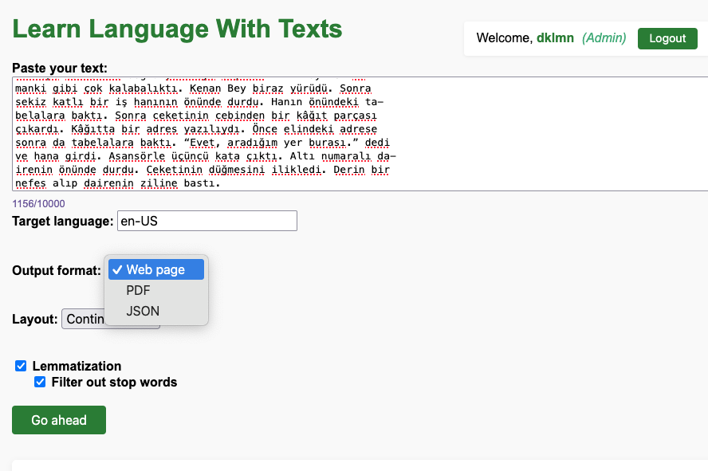
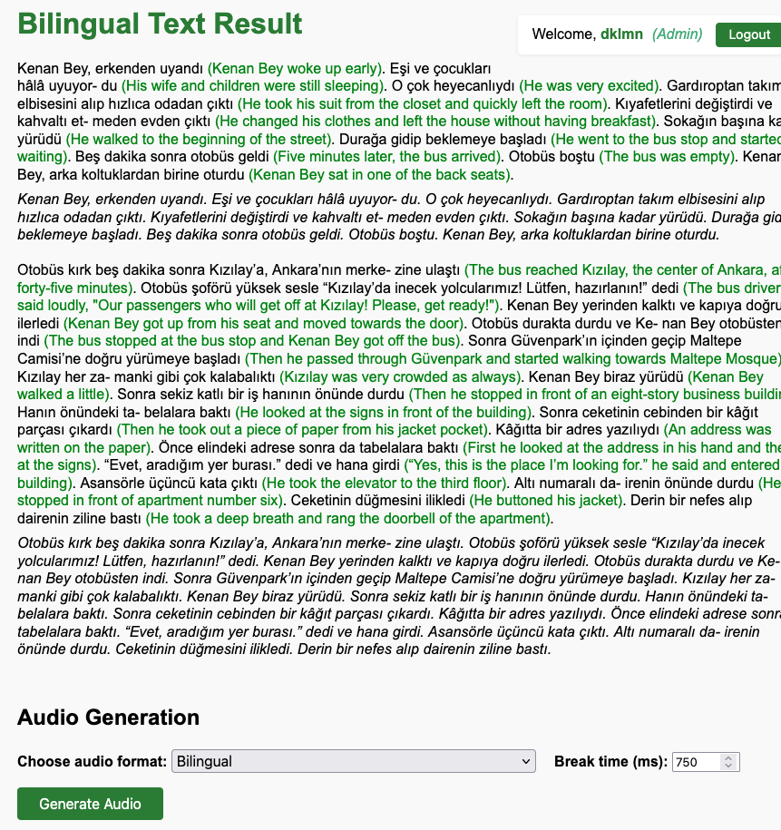
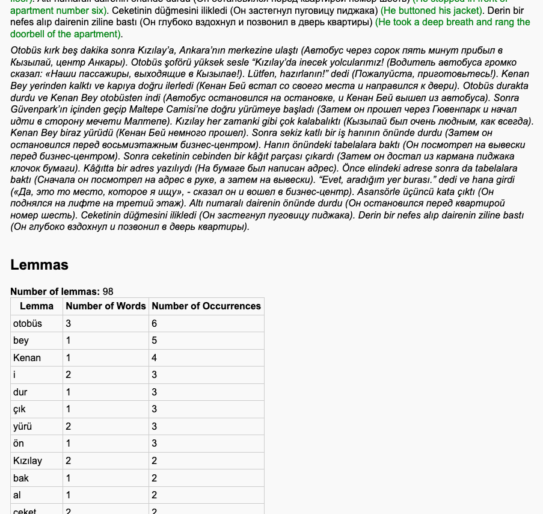

# Learn Language with Texts

A comprehensive tool for language learning that implements various effective learning techniques including the Ilya Frank's Reading Method, audio mirroring, and ANKI cards integration (upcoming).

  ## Features

- **Text Analysis and Translation**
  - Split text into syntagmas (meaningful chunks that can be pronounced in one breath)
  - Automatic translation with context preservation
  - Multiple output formats (web page, PDF, raw JSON)
  - Customizable layout options:
    - Continuous format with translations
    - Side-by-side tabular format
    - Raw JSON format
    - Generation of audio files with TTS models, using customizable SSML templates
  - Comprehension questions related to the text (0-9 questions):
    - Interactive expandable/collapsible answers in web view
    - Included as a formatted section in PDF output

- **Usage Tracking and Limits**
  - Detailed tracking of LLM usage metrics (input text length, input/output tokens)
  - Per-user usage thresholds and restrictions
  - Comprehensive usage statistics for administrators
  - Automatic prevention of threshold exceeding

- **Learning Methods**
  - Ilya Frank's Reading Method implementation
  - Audio materials for pronunciation mirroring
  - Comprehension questions with expandable answers to test understanding
  - ANKI cards integration (planned)

## TO DO
- Integrate existing solution for creation of ANKI cards
- Make it async

## Technologies Used

- **Large Language Models (LLM):** Used for advanced text analysis and translation tasks.
- **Text-to-Speech (TTS) and SSML:** Converts text to audio using TTS models and Speech Synthesis Markup Language (SSML) for expressive speech output.
- **Lemmatization Libraries:** Utilizes NLP libraries (such as spaCy) for lemmatization and syntagma splitting.
- **FastAPI:** Backend API framework for serving endpoints.
- **Pure HTML, CSS, JavaScript:** For the web frontend.

## Requirements

- Python 3.12+
- FastAPI
- Modern web browser
- Additional dependencies listed in `pyproject.toml`

## Installation

1. Clone the repository:
```bash
git clone [repository-url]
cd learn_language_with_texts
```

2. Install dependencies:
```bash
pip install -e .
```

## Setup and Deployment

### Initial Setup
```bash
 python -m src.deploy.download_nlp
```

### Launch
```bash
/usr/bin/env /home/dklmn/projects/learn_language_with_texts/.venv/bin/python -m uvicorn src.main:app --reload --host 0.0.0.0 --port 8000
```

## Usage

1. Start the application using the launch command above
2. Open your web browser and navigate to `http://localhost:8000`
3. Input your text in the source language
4. Select your desired output format and layout
5. Adjust the number of comprehension questions (0-9, default: 2)
6. Choose additional options like lemmatization if needed
7. Click "Go ahead" to process the text

## Project Structure

```
src/
├── api/            - FastAPI endpoints and utilities
├── data_classes/   - Core data structures
├── pdf_gen/        - PDF generation functionality
├── prompts/        - System prompts and templates
├── static/         - Web frontend assets
├── text_processing/- Text analysis and translation
└── tts/           - Text-to-speech functionality
```

## Screenshots

### Main Page

*The application's main page where users can input text and select processing options.*

### Results Page

*The results page displaying the processed bilingual text with translations and interactive comprehension questions with expandable answers.*

### Lemmatization Process

*Visualization of the lemmatization process used for text analysis.*


## Contact

telegram: @dklmn