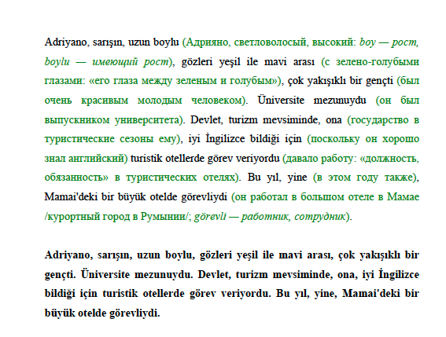

# Features
## Given as input some text,  (will be referring to the language of this text as source language), need to split this text into syntagmas (syntagma is usually part of text that can be pronounced in one breath, usually several word), and translate it.
This part has been implemented in create_bilingual_text of src/text_processing/llm_communicator.py module.
Need to create API endpoint basing on this, and some web-page as front-end.

On the initial web page for input there need to be textbox to paste text for input. 
It should contain also some option list to define output file format - either new web-page or pdf file to download or raw json.
It should contain also the option to specify the layout of the output, - it should be either continuous, like in the example here

- for each paragraph syntagmas with translations in the top part, then the whole paragraph without translations. Hightlight translations with green color of font.

Or it can be tabular "side-by-side" format, - left part is source text synagmas, right - target language.
Or it could be just raw json without andy additional formatting, - in that case option to specify layout does not make sense and should be hidden.

After user clicks "Go ahead" button the text should be passed to API that should produce translation and give it back to user as in selected format

## Non-functional requirements.
- Use pure html, css and java script for front-end part
- Use Fast API for back-end api end-points

